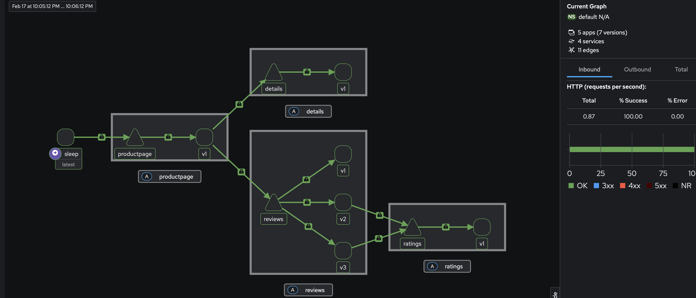
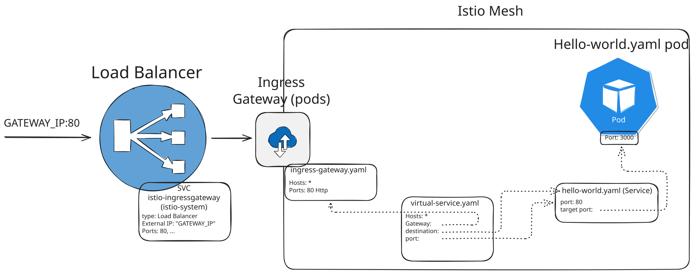

# Istio Learning

## Requirements

- Docker
- kind > v0.31.0
- cloud-provider-kind

## Pre-setup

`kind create cluster --name istio-cluster --config kind-config.yaml --wait 5m`

Run `kubectl get nodes -o wide` to verify installation

Run cloud provider kind for LoadBalancer cloud-like feature `sudo /opt/homebrew/bin/cloud-provider-kind`

## Setup

1. Run download script (https://istio.io/latest/docs/releases/supported-releases/#support-status-of-istio-releases):

    `curl -L ht‌tps://istio.io/downloadIstio | ISTIO_VERSION=1.29.0 sh -`

2. Export path:

    ```sh
    cd istio-1.29.0
    export PATH=$PWD/bin:$PATH # Only valid in this terminal session
    istioctl version
    ```
3. Install istio on cluster

     `istioctl install -f demo-profile.yaml` or `istioctl install --set profile=demo`

    [IstioOperator resource](https://istio.io/latest/docs/reference/config/istio.operator.v1alpha1/) [demo-profile.yaml](/demo-profile.yaml) can be further customized for installation onto k8s.

4. Check installation:

    `kubectl get pods -n istio-system` 

    `istiod` is a service for mutating webhook configuration (sidecar injection)

Customization can be provided to each installed chart. To review the available settings that can be updated for istiod as example: `helm show values istio/istiod`

### Uninstall istio

`istioctl uninstall -n istio-system`

Or to remove all Istio namespace resources:

`kubectl delete namespace istio-system`

### Enable automatic sidecar injection

```sh
kubectl label namespace default istio-injection=enabled`
kubectl get namespace -L istio-injection

kubectl create deploy my-nginx --image=nginx
```

It should shows a pod containing 2 containers

## Observability

Deploy a sample application and a sleep service:

```sh
kubectl apply -f istio-1.26.0/samples/bookinfo/platform/kube/bookinfo.yaml
kubectl apply -f istio-1.26.0/samples/sleep/sleep.yaml 
```

Make an HTTP call
```sh
PRODUCTPAGE_POD=$(kubectl get pod -l app=productpage -ojsonpath='{.items[0].metadata.name}')
SLEEP_POD=$(kubectl get pod -l app=sleep -ojsonpath='{.items[0].metadata.name}')
kubectl exec -it "$SLEEP_POD" -- sh -c 'curl -s productpage:9080/productpage | head'
```

Prometheus scrape endpoint is:

```sh
kubectl exec $PRODUCTPAGE_POD -c istio-proxy curl localhost:15090/stats/prometheus`
```

Deploy Prometheus and Grafana in istio-system namespace already configured to scrape metrics from workloads every 15 seconds:

```sh
kubectl apply -f istio-1.26.0/samples/addons/prometheus.yaml
kubectl apply -f istio-1.26.0/samples/addons/grafana.yaml # it contains pre-made dashboards
```

You can open prometheus/grafana dashboard locally:

```sh
istioctl dashboard prometheus
istioctl dashboard grafana
```

In another terminal make some calls to show something in the dashboards:

```sh
SLEEP_POD=$(kubectl get pod -l app=sleep -ojsonpath='{.items[0].metadata.name}')
while true; do kubectl exec $SLEEP_POD -it -- curl productpage:9080/productpage; sleep 0.3; done
```

### Tracing

The Envoy sidecars are configured to send their trace information to a distributed tracing collector. Deploy a collector:

```sh
kubectl apply -f istio-1.26.0/samples/addons/jaeger.yaml
```

Make some calls:

```sh
SLEEP_POD=$(kubectl get pod -l app=sleep -ojsonpath='{.items[0].metadata.name}')
while true; do kubectl exec $SLEEP_POD -it -- curl productpage:9080/productpage; sleep 1; done
```

Enable tracint and open jaeger dashboard:

```sh
kubectl apply -f - <<EOF
apiVersion: telemetry.istio.io/v1
kind: Telemetry
metadata:
  name: mesh-default
  namespace: istio-system
spec:
  tracing:
  - providers:
    - name: jaeger
    randomSamplingPercentage: 100.00
EOF

istioctl dashboard jaeger
```

### Kiali

Open source graphical console designed for Istio which uses metrics stored in prometheus:

```sh
kubectl apply -f istio-1.26.0/samples/addons/kiali.yaml
istioctl dashboard kiali
```



## Traffic Management

### Ingress

Configure istio ingress:

```sh
kubectl apply -f trafficmanagement/ingress-gateway.yaml
export GATEWAY_IP=$(kubectl get svc -n istio-system istio-ingressgateway -ojsonpath='{.status.loadBalancer.ingress[0].ip}')
echo $GATEWAY_IP
```

Create a sample app with a service:

```sh
kubectl apply -f trafficmanagement/hello-world.yaml
```

Create a virtual service:

```sh
kubectl apply -f trafficmanagement/virtual-service.yaml
kubectl get vs
```

```sh
curl -v http://$GATEWAY_IP/
```

In the response `server: istio-envoy` shows that the request went through the ingress Envoy proxy.

```sh
kubectl delete deploy hello-world
kubectl delete service hello-world
kubectl delete vs hello-world
kubectl delete gateway gateway
```

#### How the YAML maps to the flow

- `kubectl get svc -n istio-system istio-ingressgateway` gives the external IP used by `curl`.
- `Service istio-ingressgateway` is the Kubernetes entry point exposed as `LoadBalancer`.
- `Gateway.spec.selector.istio: ingressgateway` binds the `Gateway` resource to the ingress gateway pod (`kubectl get pods -n istio-system -l istio=ingressgateway`).
- `Gateway.spec.servers[0].port.number: 80` and `protocol: HTTP` mean the ingress Envoy listens for HTTP traffic on port `80`.
- `Gateway.spec.servers[0].hosts: ["*"]` means any host header is accepted.
- `VirtualService.spec.gateways: ["gateway"]` says: apply these routing rules only for traffic entering through that Gateway.
- `VirtualService.spec.hosts: ["*"]` means the VirtualService matches any host already accepted by the Gateway.
- `VirtualService.spec.http[0].route[0].destination.host` points to the Kubernetes Service `hello-world.default.svc.cluster.local`.
- `Service.spec.selector.app: hello-world` selects the application pod.
- `Service.spec.ports[0].port: 80` and `targetPort: 3000` forward traffic from Service port `80` to the container port `3000`.



### Resources to manage traffic in Istio

Apart from Gateway, istio offers other resources to manage traffic:

- [Virtual Service](https://istio.io/latest/docs/reference/config/networking/virtual-service/): configure routing rules for services within the istio mesh:
    - split the traffic based on weights (70% to A, 30% to B)
    - route traffic based on some matching rule (e.g. header)
    - redirect traffic
    - mirroring traffic (fire and forget)
- [DestinationRule](https://istio.io/latest/docs/reference/config/networking/destination-rule/): contains rules applied after routing decision, configuring how to reach the target service (load balancer, connection pool and TLS settings).
- [Service Entry](https://istio.io/latest/docs/reference/config/networking/service-entry/): make an external service or API as part of the mesh (will istio features)

#### Weighted traffic

Route traffic between different service versions.

```sh
kubectl apply -f trafficrouting-weightbased/ingress-gateway.yaml

kubectl apply -f trafficrouting-weightbased/web-frontend.yaml

kubectl apply -f trafficrouting-weightbased/customers-v1.yaml

kubectl apply -f trafficrouting-weightbased/web-frontend-vs.yaml
```

Create a DestinationRule based on a label:

```sh
kubectl apply -f trafficrouting-weightbased/customers-dr.yaml
```

```sh
kubectl apply -f trafficrouting-weightbased/customers-dr.yaml
kubectl apply -f trafficrouting-weightbased/customers-vs.yaml
kubectl apply -f trafficrouting-weightbased/customers-v2.yaml
export GATEWAY_IP=$(kubectl get svc -n istio-system istio-ingressgateway -ojsonpath='{.status.loadBalancer.ingress[0].ip}')
```

Opening `GATEWAY_IP` on the browser should return 50% responses from customers v2 and 50% responses from customers v2.

Clean up:

```sh
kubectl delete deploy web-frontend customers-{v1,v2}
kubectl delete svc customers web-frontend
kubectl delete vs customers web-frontend
kubectl delete dr customers
kubectl delete gw gateway
```

#### Header based traffic

```sh
kubectl apply -f requestpheaderbasedgateway.yaml
kubectl apply -f trafficrouting-requestpheaderbased/web-frontend.yaml
kubectl apply -f trafficrouting-requestpheaderbased/customers.yaml
```

Opening `GATEWAY_IP` on the browser you should only see the NAME column on the resulting page since all traffic is routed to `customers-v1` service. However `curl -H "user: debug" http://$GATEWAY_IP/ | grep -E 'CITY|NAME'` will hit the `customer-v2` service.

```sh
kubectl delete deploy web-frontend customers-{v1,v2}
kubectl delete svc customers web-frontend
kubectl delete vs customers web-frontend
kubectl delete dr customers
kubectl delete gateway gateway
```

### Resiliency & Failure Injection: timeout, retry & circuit breaking

These can be specified in the Virtual Service

#### Timeout

```yaml
- route:
  - destination:
      host: customers.default.svc.cluster.local
      subset: v1
  timeout: 10s
```

#### Retries

Where if a pod fails, the request will be retried to another pod:

```yaml
- route:
  - destination:
      host: customers.default.svc.cluster.local
      subset: v1
  retries:
    attempts: 10
    perTryTimeout: 2s
    retryOn: connect-failure,reset
```

#### Circuit breaking with health checks

Envoy perform health checks, not directly calling the service but using measures like:

- consecutive failures
- temporal success rate
- latency
- ...

If they are not healthy, they are removed from the healthy load balacing pool:

```yaml
apiVersion: networking.istio.io/v1beta1
kind: DestinationRule
metadata:
  name: customers
spec:
  host: customers
  trafficPolicy:
    connectionPool: # Trigger circuit break if nOfTCPConnection > 1 or nOfHttpConnect > 1 or > 1 request per conn
      tcp:
        maxConnections: 1
      http:
        http1MaxPendingRequests: 1
        maxRequestsPerConnection: 1
      # If one of the above event happen return 503
    outlierDetection:
      consecutive5xxErrors: 1
      baseEjectionTime: 3m # This is multiplied by the number the pod has been ejected in a row
      interval: 1s # Check every... if healthy decrement multiplier above 
      maxEjectionPercent: 100 # max percentage of pod that can be ejected from the pool
```

#### Fault injection

It's possible to simulate a slow network or abort the Http request. Fault injections don't trigger retry policies!


```sh
kubectl apply -f delays-and-failure-injection/gateway.yaml
kubectl apply -f delays-and-failure-injection/web-frontend.yaml
kubectl apply -f delays-and-failure-injection/customers.yaml
kubectl apply -f delays-and-failure-injection/customers-delay.yaml

export GATEWAY_IP=$(kubectl get svc -n istio-system istio-ingressgateway -ojsonpath='{.status.loadBalancer.ingress[0].ip}')
curl http://$GATEWAY_IP/ # Some requests take 5s

kubectl apply -f delays-and-failure-injection/customers-fault.yaml
curl http://$GATEWAY_IP/ # Some requests return 500
```

```sh
kubectl delete deploy web-frontend customers-v1
kubectl delete svc customers web-frontend
kubectl delete vs customers web-frontend
kubectl delete gateway gateway
```

#### Bring external service into the mesh

It's possible to define timeouts and retries to external services:

apiVersion: networking.istio.io/v1beta1
kind: ServiceEntry
metadata:
  name: googleapis-svc-entry
spec:
  hosts:
  - www.googleapis.com
  location: MESH_EXTERNAL let istio know about this external service (it will put it in its registry)
  resolution: DNS
  ports:
  - number: 443
    name: https
    protocol: TLS

And secure external calls by allowing the services inside the mesh to call just listed external services:

```sh
istioctl install --set profile=demo \
    --set meshConfig.outboundTrafficPolicy.mode=REGISTRY_ONLY

kubectl apply -f istio-1.29.0/samples/sleep/sleep.yaml
SLEEP_POD=$(kubectl get pod -l app=sleep -ojsonpath='{.items[0].metadata.name}')

kubectl exec $SLEEP_POD -it -- curl -v https://github.com # It will fail
kubectl apply -f limit-external-calls/github-external.yml

kubectl delete -f istio-1.29.0/samples/sleep/sleep.yaml
kubectl delete serviceentry github-external
```    
